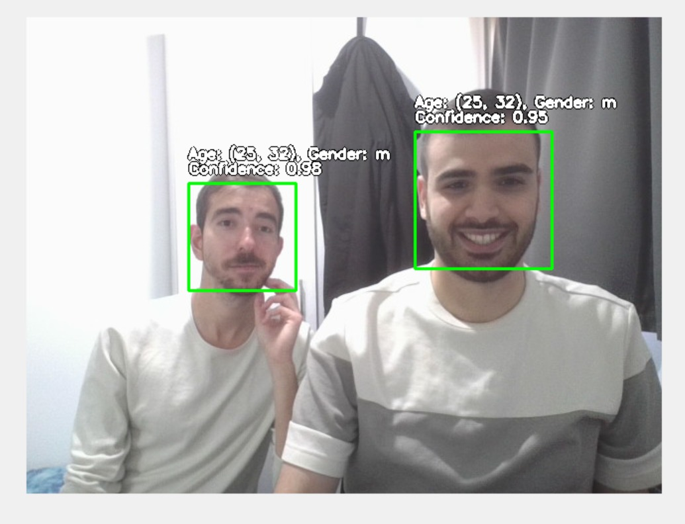

# VisAge: Age and Gender Classification from Face Images

## Overview
VisAge is a comprehensive machine learning project focused on gender and age classification from facial images using the Adience Benchmark dataset. The project explores traditional machine learning and deep learning approaches, compares different feature extraction techniques, and includes a real-time camera application for age and gender prediction.

You can see the project report [here](docs/submission.pdf).

## Features
- Complete data exploration and preprocessing pipeline for the Adience dataset
- Feature extraction using ResNet50 and PCA
- Implementation of various classification models:
  - Traditional ML: Softmax, SVM, Random Forest, AdaBoost, KNN
  - Neural Networks: MLP, CNN
- Parallel processing pipelines for RGB and grayscale images
- Extensive model evaluation and performance analysis
- Research on model fairness across different demographics
- Real-time camera application for age and gender prediction

## Dataset
The project uses the [Adience Benchmark dataset](https://www.kaggle.com/datasets/ttungl/adience-benchmark-gender-and-age-classification) for gender and age classification, which contains:
- ~19,000 face images of 2,284 subjects
- Age labels across 8 ranges: (0-2), (4-6), (8-12), (15-20), (25-32), (38-43), (48-53), (60+)
- Gender labels: Male, Female
- Various lighting conditions, poses, and image quality

## Project Structure

    VisAge/
    ├── data_exploration.ipynb      # Dataset analysis and preprocessing
    ├── img2vec.py                  # Feature extraction using ResNet50
    ├── grayscale_models.ipynb      # Models trained on grayscale images
    ├── rgb_models.ipynb            # Models trained on RGB images
    ├── questions/
    │   └── q1.ipynb                # Analysis of model fairness across demographics
    ├── old_models/                 # Earlier model implementations
    ├── camera-viewer-app/          # Real-time age and gender classification application
    │   ├── src/
    │   │   ├── main.py             # Application entry point
    │   │   ├── ui/                 # User interface components
    │   │   └── utils/              # Utility functions
    │   └── models/                 # Pre-trained models
    └── docs/                      # Project report and documentation

## Installation

### Prerequisites
- Python 3.7+
- CUDA-compatible GPU (recommended for faster training)

### Setup
1. Clone the repository:

```bash
git clone https://github.com/ShayGali/VisAge.git
```

2. Create a virtual environment:

```bash
python -m venv venv
# for Windows
.\venv\Scripts\activate

# for MacOS/Linux
source venv/bin/activate
```


3. Install dependencies:

```bash
pip install -r requirements.txt
```

4. Download the dataset:
- Go to [Adience dataset on Kaggle](https://www.kaggle.com/datasets/ttungl/adience-benchmark-gender-and-age-classification)
- Download and extract to the `data` folder
- Go to [UTKFace dataset on Kaggle](https://www.kaggle.com/jangedoo/utkface-new)
- Download and extract to the `data` folder


## Usage

### Data Preprocessing
Run the data exploration notebook to preprocess the dataset:

```bash
jupyter notebook data_exploration.ipynb
```

### Model Training
Execute the notebooks to train and evaluate models:

```bash
jupyter notebook rgb_models.ipynb
jupyter notebook grayscale_models.ipynb
```

### Camera Application
Run the real-time age and gender classification application:

```bash
cd camera-viewer-app
python src/main.py
```


## Model Performance

### RGB Models (Best Results)
| Model | Test Accuracy |
|-------|--------------|
| MLP | 34.78% |
| CNN | 32.98% |
| Softmax | 32.37% |
| Random Forest | 32.18% |
| AdaBoost | 31.62% |
| KNN (k=9) | 23.33% |
| SVM | 17.51% |

### Grayscale Models
| Model | Test Accuracy |
|-------|--------------|
| MLP | 32.29% |
| CNN | 31.53% |
| Random Forest | 31.67% |
| Softmax | 31.35% |
| AdaBoost | 26.50% |
| KNN (k=9) | 24.40% |
| SVM | 17.81% |

## Research Findings

### Model Performance Across Demographics
- Performance varies across racial groups, with generally lower accuracy for Black faces
- The Softmax model showed the most consistent performance across demographics

### Real-Time Application Performance
- Models work efficiently in real-time with standard webcam hardware
- Performance remains stable with varying lighting conditions and when subjects wear glasses
- Processing every 5th frame maintains good balance between performance and computational efficiency

### Age and Gender Classification Insights
- Gender classification is generally more accurate than age classification
- Most classification errors occur between adjacent age groups
- The MLP model demonstrated the best balance between accuracy and generalization

## Camera Viewer Application

The real-time camera application detects faces and predicts age and gender using our best-performing model.

### Features:
- Real-time face detection using OpenCV
- Age and gender prediction with confidence scores
- Green bounding boxes around detected faces
- Efficient processing for smooth performance on standard hardware

## Challenges and Limitations

### Data Challenges:
- Inconsistent age labeling in the original dataset
- Class imbalance across age groups
- Limited diversity in the dataset

### Technical Challenges:
- Balancing feature complexity with model performance
- Tuning early stopping parameters to prevent overfitting
- Combined age-gender prediction complexity

###  Application Demo


## Contributors
- [Michael Dadush](https://github.com/michael34666)
- [Shay Gali](https://github.com/shaygali)

## License
This project is released under the MIT License.